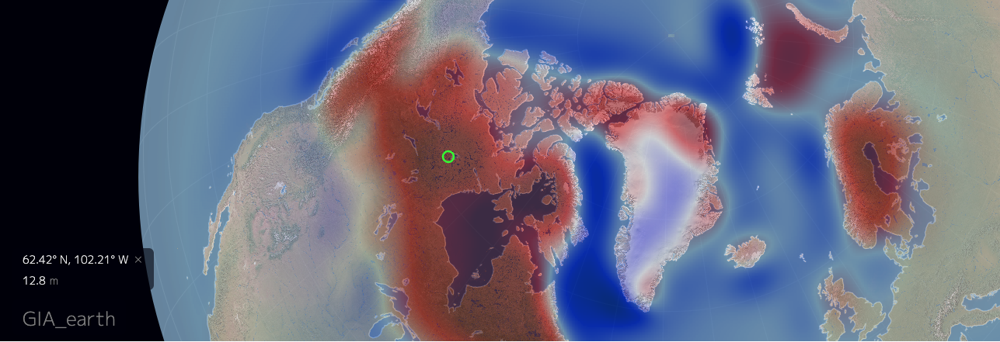

earth
=====
Modification notes from Viet
- turning the earth to GIA earth
- No need wind, wave so I comment out the animate, animatorAgent, and fieldAgen in the `earth.js`

**NOTE: the location of `dev-server.js` has changed from `{repository}/server/` to `{repository}/`**

"earth" is a project to visualize global weather conditions.

A customized instance of "earth" is available at http://earth.nullschool.net.

"earth" is a personal project I've used to learn javascript and browser programming, and is based on the earlier
[Tokyo Wind Map](https://github.com/cambecc/air) project.  Feedback and contributions are welcome! ...especially
those that clarify accepted best practices.

building and launching
----------------------

After installing node.js and npm, clone "earth" and install dependencies:

    git clone https://github.com/vietbuiminh/GIA_earth
    cd GIA_earth
    npm install

Next, launch the development web server:

    node dev-server.js 8080

Finally, point your browser to:

    http://localhost:8080

The server acts as a stand-in for static S3 bucket hosting and so contains almost no server-side logic. It
serves all files located in the `earth/public` directory. See `public/index.html` and `public/libs/earth/*.js`
for the main entry points. Data files are located in the `public/data` directory, and there is one sample
weather layer located at `data/weather/current`.

*For Ubuntu, Mint, and elementary OS, use `nodejs` instead of `node` instead due to a [naming conflict](https://github.com/joyent/node/wiki/Installing-Node.js-via-package-manager#ubuntu-mint-elementary-os).

Please visit [nullschoolearth](https://earth.nullschool.net/#current/wind/surface/level/orthographic=105.86,21.80,1882) for their original work.